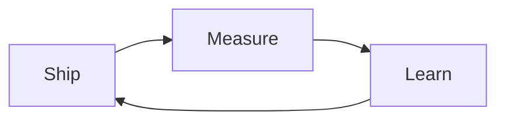

<!--
  PROFILE SETUP (find/replace once)
  ────────────────────────────────
  • stuchain → your exact GitHub login (also the profile repo name)
  • YOUR_DISPLAY_NAME    → how you want to be called in the typing animation (URL-encode spaces as + or %20 in the typing SVG URL if needed)
  • YOUR_SITE_URL, social URLs in the “Connect” row
  • Featured repos: replace owner/repo and descriptions
  • Blog workflow: edit .github/workflows/blog-post-workflow.yml → feed_list (comma-separated RSS URLs)
  • After first push: Actions → “Generate contribution snake” → Run workflow (or wait for cron)
  • Repo Settings → Actions → General → Workflow permissions: Read and write
  • Optional WakaTime card: deploy your own github-readme-stats (see collapsible section below)
-->

# Hi, I'm **Stelios**

[Website](https://YOUR_SITE_URL) · [LinkedIn](https://www.linkedin.com/in/YOUR_HANDLE/) · [X](https://x.com/YOUR_HANDLE) · [Email](mailto:you@example.com)

---

## Snapshot

<table>
  <tr>
    <td align="center" valign="top" width="33%">
      
    </td>
    <td align="center" valign="top" width="33%">
      
    </td>
    <td align="center" valign="top" width="33%">
      
    </td>
  </tr>
</table>

> **Note:** Public stats APIs can rate-limit. If cards break often, fork [github-readme-stats](https://github.com/anuraghazra/github-readme-stats) and point images to your deployment.

<picture>
  <source media="(prefers-color-scheme: dark)" srcset="./dist/github-snake-dark.svg" />
  <source media="(prefers-color-scheme: light)" srcset="./dist/github-snake.svg" />
  
</picture>

Snake SVGs are generated by GitHub Actions in this repo. Run the workflow once after cloning so the images exist.

---

## Stack

| Focus | Tools |
| ----- | ----- |
| Languages | TypeScript, JavaScript, Python, Go |
| Frontend | React, modern CSS, accessibility-minded UI |
| Backend | Node, APIs, PostgreSQL, Redis |
| Platform | Docker, cloud deploys, GitHub Actions |

---

## Featured

| Project | What it is |
| ------- | ---------- |
| [**stuchain / awesome-thing**](https://github.com/stuchain/awesome-thing) | One-line pitch — problem solved, who it is for. |
| [**stuchain / toolkit**](https://github.com/stuchain/toolkit) | CLI, library, or template you want visitors to try first. |
| [**stuchain / experiment**](https://github.com/stuchain/experiment) | R&D, demo, or OSS you are actively evolving. |

Pin 6 repos on your GitHub profile for the row under this README — keep names and descriptions aligned with what you highlight here.

---

## Now & next

- **Building:** replace with your current focus.
- **Learning:** replace with what you are digging into this quarter.
- **Collaborating:** replace with the kinds of issues or roles you welcome.

---

## Latest posts

<!-- BLOG-POST-LIST:START -->
<!-- BLOG-POST-LIST:END -->

Feeds are configured in `.github/workflows/blog-post-workflow.yml`. Replace the placeholder RSS with your blog, Dev.to, Medium export, etc.

---

<strong>More — trophies, badges, optional integrations</strong>

### Trophies

### Badge strip (swap for your stack)

### WakaTime (optional)

The public `github-readme-stats` instance does not use your private WakaTime key. To show a **WakaTime** card, deploy your own fork of [github-readme-stats](https://github.com/anuraghazra/github-readme-stats) on Vercel, add `WAKATIME_API_KEY` in project env vars, then embed:

`https://YOUR_VERCEL_URL/api/wakatime?username=@your_wakatime_username&theme=tokyonight&hide_border=true`

### Spotify “now playing” (optional)

See [Novatorem](https://github.com/novatorem/novatorem): small deploy + tokens, then embed the generated image URL in this section.

### Deeper metrics (optional)

[lowlighter/metrics](https://github.com/lowlighter/metrics) can generate rich SVGs via Actions; start from their profile examples and trim plugins to stay fast.

### More ideas

Curated lists: [awesome-github-readme-tools](https://github.com/HenryLok0/awesome-github-readme-tools), [awesome-profile-readme](https://github.com/tobimori/awesome-profile-readme).

---

**Thanks for stopping by — PRs and interesting problems welcome.**

