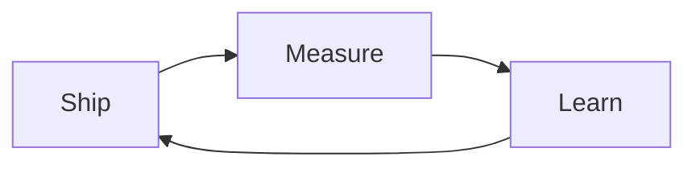

<!--
  Optional tweaks: typing SVG lines · blog feed_list in .github/workflows/blog-post-workflow.yml
  · Actions: workflow permissions Read and write; run “Generate contribution snake” once if dist/ is empty
-->

[Portfolio](https://stuchain.github.io/portfolio) · [LinkedIn](https://www.linkedin.com/in/stelios-vasileiou/) · [Email](mailto:stelios.vasiliou@icloud.com)

---

## Snapshot

<table>
  <tr>
    <td align="center" valign="top" width="33%">
      
    </td>
    <td align="center" valign="top" width="33%">
      
    </td>
    <td align="center" valign="top" width="33%">
      
    </td>
  </tr>
</table>

> **Note:** The official public instance `github-readme-stats.vercel.app` often returns **503** when overloaded. These cards use a third-party mirror (`readme-stats-github.vercel.app`). If images break again, deploy your own fork of [github-readme-stats](https://github.com/anuraghazra/github-readme-stats) to Vercel and swap the host in the two `` URLs above.

<picture>
  <source media="(prefers-color-scheme: dark)" srcset="./dist/github-snake-dark.svg" />
  <source media="(prefers-color-scheme: light)" srcset="./dist/github-snake.svg" />
  
</picture>

Snake SVGs are generated by GitHub Actions in this repo. Run the workflow once after cloning so the images exist.

---

## Stack

| Focus | Tools |
| ----- | ----- |
| Languages | Python, Rust, TypeScript, JavaScript, Solidity |
| Web & UI | React, Next.js (App Router), Streamlit, HTML/CSS |
| Backend & data | Rust (axum, tokio), Python (Flask, services), SQLite (sqlx), MQTT pipelines |
| Chain & security | Hardhat/Solidity, local Ethereum tooling, Solana-style demos, cryptography & protocols |
| DevOps | Docker, GitHub Actions, scripting (PowerShell/bash) |

---

## Featured

| Project | What it is |
| ------- | ---------- |
| [**stuchain / CuePoint**](https://github.com/stuchain/CuePoint) | DJs: clean and enrich Rekordbox libraries with Beatport metadata, fast matching, and an auditable review workflow. |
| [**stuchain / iot-oracle-gateway**](https://github.com/stuchain/iot-oracle-gateway) | End-to-end IoT telemetry: Python simulator over MQTT, oracle with EWMA/z-score anomalies, optional Solidity anchoring, Streamlit dashboard. |
| [**stuchain / ctf-maze-arena**](https://github.com/stuchain/ctf-maze-arena) | Maze generation, algorithm visualization, and solver comparison — Rust (axum) + TypeScript/Next.js + SQLite. |
| [**stuchain / mini-secure-channel-solana**](https://github.com/stuchain/mini-secure-channel-solana) | Six-phase secure channel: X25519, MITM, Ed25519, ChaCha20-Poly1305 AEAD, Solana-style decentralized key verification. |

Pin 6 repos on your GitHub profile for the row under this README — keep names and descriptions aligned with what you highlight here.

---

## Now & next

- **Building:** replace with your current focus.
- **Learning:** replace with what you are digging into this quarter.
- **Collaborating:** replace with the kinds of issues or roles you welcome.

---

## Latest posts

<!-- BLOG-POST-LIST:START -->
<!-- BLOG-POST-LIST:END -->

Feeds are configured in `.github/workflows/blog-post-workflow.yml`. Replace the placeholder RSS with your blog, Dev.to, Medium export, etc.

---

<strong>More — trophies, badges, optional integrations</strong>

### Trophies

### Badge strip

### WakaTime (optional)

The public `github-readme-stats` instance does not use your private WakaTime key. To show a **WakaTime** card, deploy your own fork of [github-readme-stats](https://github.com/anuraghazra/github-readme-stats) on Vercel, add `WAKATIME_API_KEY` in project env vars, then embed:

`https://YOUR_VERCEL_URL/api/wakatime?username=@your_wakatime_username&theme=tokyonight&hide_border=true`

### Spotify “now playing” (optional)

See [Novatorem](https://github.com/novatorem/novatorem): small deploy + tokens, then embed the generated image URL in this section.

### Deeper metrics (optional)

[lowlighter/metrics](https://github.com/lowlighter/metrics) can generate rich SVGs via Actions; start from their profile examples and trim plugins to stay fast.

### More ideas

Curated lists: [awesome-github-readme-tools](https://github.com/HenryLok0/awesome-github-readme-tools), [awesome-profile-readme](https://github.com/tobimori/awesome-profile-readme).

---

**Thanks for stopping by — PRs and interesting problems welcome.**

